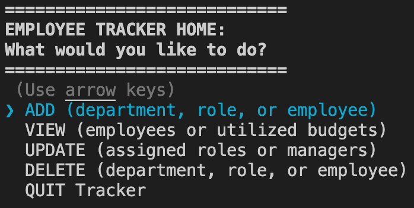
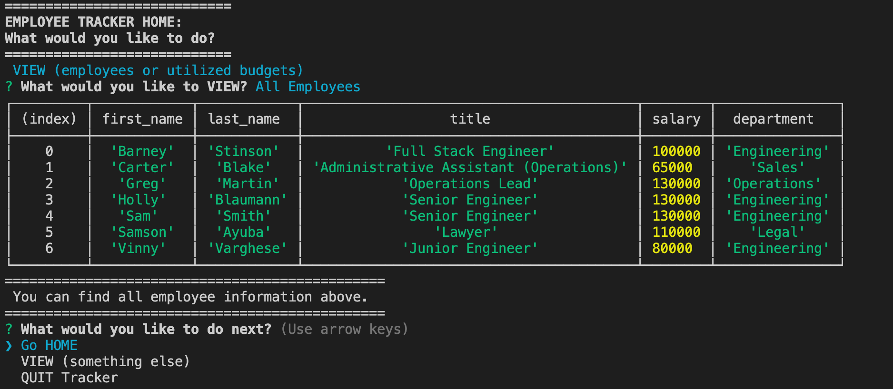

# Employee Tracker 
  This is a command-line application that allows users to keep track of employees in their company. The system utilizes inquirer, mysql and a well fitted database to keep track of pertinent information. The user can add, delete, or view departments, roles, and employees from the system. They can also update the assigned role or manager for any employee.
  ## Table of Contents
  1. [Installation](#Installation)
  2. [Usage](#Usage)
  3. [Contributing](#Contributing)
  4. [Tests](#Tests)
  5. [License](#License)
  6. [Questions](#Questions)
  ## Installation
       $ npm install 
  ## Usage
  This application is meant to be used to keep track of the ever changing employee make-up of any given company. The departments, roles and salaries can all be custom fit to be used in any industry. HR departments can make good use of this application for large teams. 
  ## Contributing
  Contribution is welcome. Please commit often and comment added/improved lines.
  ## Tests
       No test instructions.
  ## License
  >BSD 
  ## Questions

  * GitHub: [VinAVarghese](https://github.com/VinAVarghese)
  * Email: [VinAVarghese@gmail.com](mailto:VinAVarghese@gmail.com)
  
  You are welcome to email me with any questions about the application with the subject line "RE: Employee Tracker"
  ## Links/Images
  
  
